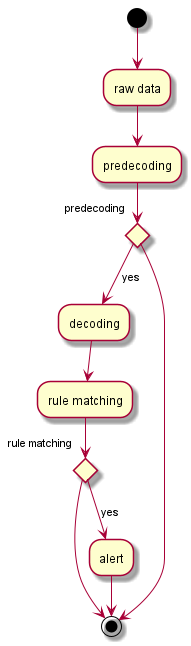
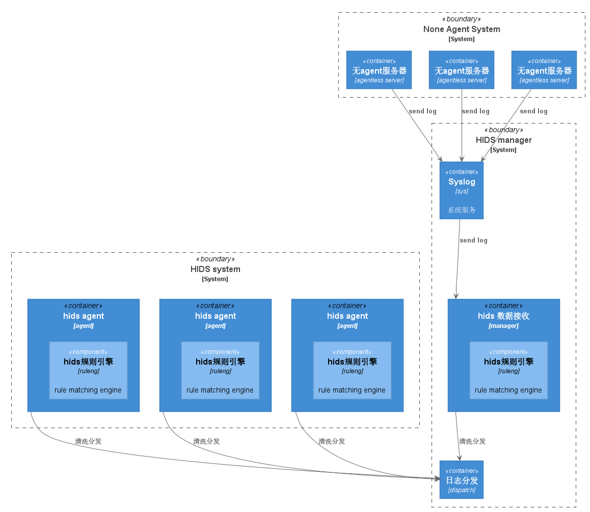

# Rule Matching IDS 规则引擎实现及分析

ossec是开源的hids系统，用于监控本地文件和日志检查做为入侵检测基础, rootkit告警和文件完整性检查，以及操作系统安全基线检查等功能。

其中最为重要的功能模块为，解析引擎，规则引擎，规则。

首先通过引擎和规则识别相关日志内容，目的是保证最小范围代码改动或不改动代码并能在最大程度的覆盖需求（已知需求和未知需求）。

## 规则引擎流程

原始数据经过引擎，通过规则定义识别非标准数据，提取关键内容对异常数据进行匹配和告警。

以下图为例： 原始数据经过引擎decoder进行解析，将符合过滤条件的数据保留，进行规则集匹配。




### ossec 规则识别过程

```
Mar  8 22:39:13 ip-10-0-0-10 sshd[2742]: Accepted publickey for root from 73.189.131.56 port 57516
```

```
Mar  8 22:39:13 ip-10-0-0-10 sshd[2742]: Accepted publickey for root from 73.189.131.56 port 57516

**Phase 1: Completed pre-decoding.
       full event: 'Mar  8 22:39:13 ip-10-0-0-10 sshd[2742]: Accepted publickey for root from 73.189.131.56 port 57516'
       hostname: 'ip-10-0-0-10'
       program_name: 'sshd'
       log: 'Accepted publickey for root from 73.189.131.56 port 57516'

**Phase 2: Completed decoding.
       decoder: 'sshd'
       dstuser: 'root'
       srcip: '73.189.131.56'

**Phase 3: Completed filtering (rules).
       Rule id: '5715'
       Level: '3'
       Description: 'sshd: authentication success.'
**Alert to be generated.
```

### snort识别过程

```
alert tcp ![192.168.1.0/24,10.1.1.1.0/24] any ->[192.168.1.0/24,10.1.1.0/24] 111 (content:"|00 01 86 a5|"; msg:"external mountd access";)

源ip地址不是在192.168.1.0/24,10.1.1.1.0/24网段内的主机，在访问目的ip范围192.168.1.0/24,10.1.1.0/24主机111端口时，payload内容特征码匹配到00 01 86 a5即产生“external mountd access”告警。
```

```
alert tcp any any -> 192.168.1.0/24 80 (content:"cgi-bin/phf";offset:3;depth:22;msg:"CGI-PHF access";)

源任意地址任意端口访问192.168.1.0/24网段80端口时，payload偏移3-22字节内搜索"cgi-bin/phf"，发现则告警。
```


## 规则引擎设计参考对象

### snort 规则语义

snort是轻量级的网络入侵检测系统， 规则行为(rule's action)、协议(protocol)、源/目的IP地址、子网掩码以及源/目的端口。
规则选项包含报警信息和异常包的信息(特征码，signature)，使用这些特征码来决定是否采取规则规定的行动。 

以下为指定操作类型：

* alert： 使用选定的报警方法产生报警信息，并且记录数据包 
* log： 记录数据包 
* pass：忽略数据包 
* activate：报警，接着打开其它的dynamic规则 
* dynamic：保持空闲状态，直到被activete规则激活，作为一条log规则 
* drop: block and log the packet
* reject: block the packet, log it, and then send a TCP reset if the protocol is TCP or an ICMP port unreachable message if the protocol is UDP.
* sdrop: block the packet but do not log it.


### Ossec日志规则


以日志采集和解析为原型设计的引擎包含，OSSEC监控日志需要指定  /var/log/ossec/etc/ossec.conf 如下所示。

```
  <!-- Files to monitor (localfiles) -->

  <localfile>
    <log_format>syslog</log_format>
    <location>/var/log/messages</location>
  </localfile>

  <localfile>
    <log_format>syslog</log_format>
    <location>/var/log/secure</location>
  </localfile>

  <localfile>
    <log_format>syslog</log_format>
    <location>/var/log/maillog</location>
  </localfile>

  <localfile>
    <log_format>apache</log_format>
    <location>/var/log/httpd/error_log</location>
  </localfile>

  <localfile>
    <log_format>apache</log_format>
    <location>/var/log/httpd/access_log</location>
  </localfile>
```

每一个文件监控依赖 “decoder” 通过正则表达式进行解析日志内相关字段，例如源ip，时间，端口等

以下为ssh服务日志的decoder：

```
<decoder name="sshd">
  <program_name>^sshd</program_name>
</decoder>

<decoder name="sshd-success">
  <parent>sshd</parent>
  <prematch>^Accepted</prematch>
  <regex offset="after_prematch">^ \S+ for (\S+) from (\S+) port </regex>
  <order>user, srcip</order>
  <fts>name, user, location</fts>
  <ftscomment>alert message</ftscomment>
</decoder>

<decoder name="ssh-denied">
  <parent>sshd</parent>
  <prematch>^User \S+ from </prematch>
  <regex offset="after_parent">^User (\S+) from (\S+) </regex>
  <order>user, srcip</order>
</decoder>
```

其中fts字段表示，当decoder第一次识别到相关日志，则将程序内保存的相关内容进行告警，输出字段为设置内容。

|keyword|desc|
|-|-|
|location|Where the log came from|
|srcuser|Extracts the source username|
|dstuser|Extracts the destination (target) username|
|user|An alias to dstuser (only one of the two can be used)|
|srcip|Source ip|
|dstip|Destination ip|
|srcport|Source port|
|dstport|Destination port|
|protocol|Protocol|
|id|Event id|
|url|Url of the event|
|action|Event action (deny, drop, accept, etc)|
|status|Event status (success, failure, etc)|
|extra_data|Any extra data|

OSSEC 兼容 CIS基线检查功能，以下为ssh基线检查规则:

```
[CIS - Debian Linux - 2.3 - SSH Configuration - Empty passwords permitted {CIS: 2.3 Debian Linux} {PCI_DSS: 4.1}] [any] [http://www.ossec.net/wiki/index.php/CIS_DebianLinux]
f:/etc/ssh/sshd_config -> !r:^# && r:^PermitEmptyPasswords\.+yes;
```

### Filebeat

　首先filebeat是Beats中的一员，Beats在是一个轻量级日志采集器，可以做简单的过滤和打标记，数据的数据解析、过滤、清洗需要通过logstash完成。

* Packetbeat：网络数据（收集网络流量数据）
* Metricbeat：指标（收集系统、进程和文件系统级别的CPU和内存使用情况等数据）
* Filebeat：日志文件（收集文件数据）
* Winlogbeat：windows事件日志（收集Windows事件日志数据）
* Auditbeat：审计数据（收集审计日志）
* Heartbeat：运行时间监控（收集系统运行时的数据）

filebeat不会通过规则对终端日志进行过滤和清洗，可以通过配置文件设置过滤条件。

```
exclude_lines: ['^DBG'] #不包含匹配正则的行
include_lines: ['^ERR', '^WARN']  #包含匹配正则的行
```


### 通过规则描述行为

* 模式响应
* 入侵响应
* 操作日志记录
* 攻击日志记录

## 规则引擎在何处使用？

* 终端
* 服务端



## 参考

https://documentation.wazuh.com/3.8/user-manual/ruleset/getting-started.html